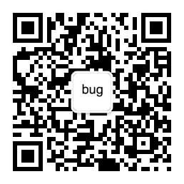

# gophers
收集Go语言相关的公众号、博客，国内Go开源项目 以及这些布道者们

布道者名单及贡献、公众号或博客地址（排名不分先后）（来自微信群：Go实践和布道者）

| 姓名           | 贡献、公众号或博客地址                                       | 二维码                                                       |
| -------------- | ------------------------------------------------------------ | ------------------------------------------------------------ |
| tonybai   | 公众号：TonyBai，博客：https://tonybai.com                   |                  |
| 波罗学         | 公众号：码途漫漫，博客：http://poloxue.com/                  |          |
| 无闻    | Gogs 作者，开源了很多优秀的项目，国内早期的 Go 语言布道者！  |                                                              |
| 柴树杉         | 《Go语言圣经》译者，《Go语言高级编程》作者，公众号：光谷码农，人称柴大 |                                                              |
| Xargin  | 《Go语言高级编程》作者，博客：http://xargin.com ，人称曹大   |                                                              |
| 芮峰云| 博客：http://xiaorui.cc/   |                                                              |
| SeekLoad         | 公众号：Golang来啦                                           |               |
| 煎鱼    | 公众号：我要煎鱼说，博客：https://book.eddycjy.com/golang/   |               |
| 大彬           | 公众号：Go语言充电站，博客：http://lessisbetter.site         |        |
| Draven         | 公众号：真没什么逻辑，博客：https://draveness.me/            |             |
| 枫林无归       | 公众号：雪之梦技术驿站，博客：https://snowdreams1006.github.io |           |
| JackieZheng    | 公众号：JackieZheng ，博客园：http://www.cnblogs.com/bigdatazj ，掘金：https://juejin.im/user/5a0da9376fb9a0452b48cbba |                                                              |
| 刘建平         | 博客：https://www.gitdig.com                                 |                                                              |
| 李文周         | 博客：https://www.liwenzhou.com                              |                                                              |
| 李晓钧         | 《深入学习Go语言》作者                                       |                                                              |
| LX 老貘        | 《Go101》作者，对Go语言细节了如指掌。公众号：Go 101          |                    |
| 毛剑           | 国内早期的 Go 语言布道者，多次为 GopherChina 演讲者          |                                                              |
| Max            | 博客：https://www.maxlivinci.com ，来自台湾同胞的 gopher     |                                                              |
| 戚银           | 博客：https://blog.thinkeridea.com                           |                                                              |
| 饶全成         | 公众号：码农桃花源，博客：https://qcrao.com ，写的 Go 语言文章很多干货！ |        |
| RyuGou         | 公众号：互联网技术窝，博客：https://i6448038.github.io/ |                                                              |
| 盛傲飞         | https://goproxy.cn 作者，速度超快的 Go 语言 proxy            |                                                              |
| 陶克路         | 公众号：golang-experts，博客：http://legendtkl.com/          |                                                              |
| 王博           | 公众号：火丁笔记，博客：https://blog.huoding.com             |                  |
| polaris | Go语言中文网站长，公众号：Go语言中文网，网站：https://studygolang.com |             |
| 肖仑文 lunny   | Gitea、Xorm 作者，国内早期的 Go 语言布道者！                 |                                                              |
| 闫磊磊         | 博客：https://leileiluoluo.com                               |                                                              |
| 于德志         | 博客：https://halfrost.com ，算法大师                        |                                                              |
| 叶剑峰         | 公众号：轩脉刃的刀光剑影，博客：https://www.cnblogs.com/yjf512 ，国内早期的 Go 语言布道者！ |  |
| 周洋           | 从 2012 年起一直从事 Go 相关开发和架构工作，多次为 GopherChina 演讲者 |                                                              |
| 张金柱         | gorm 作者                                                    |                                                              |
| 张方波         | 公众号：go语言核心编程技术                                   |                                                              |

## 加入

如果你也是 Go 布道者，欢迎提 PR，也可以加我的微信：274768166，备注：Github Gophers

